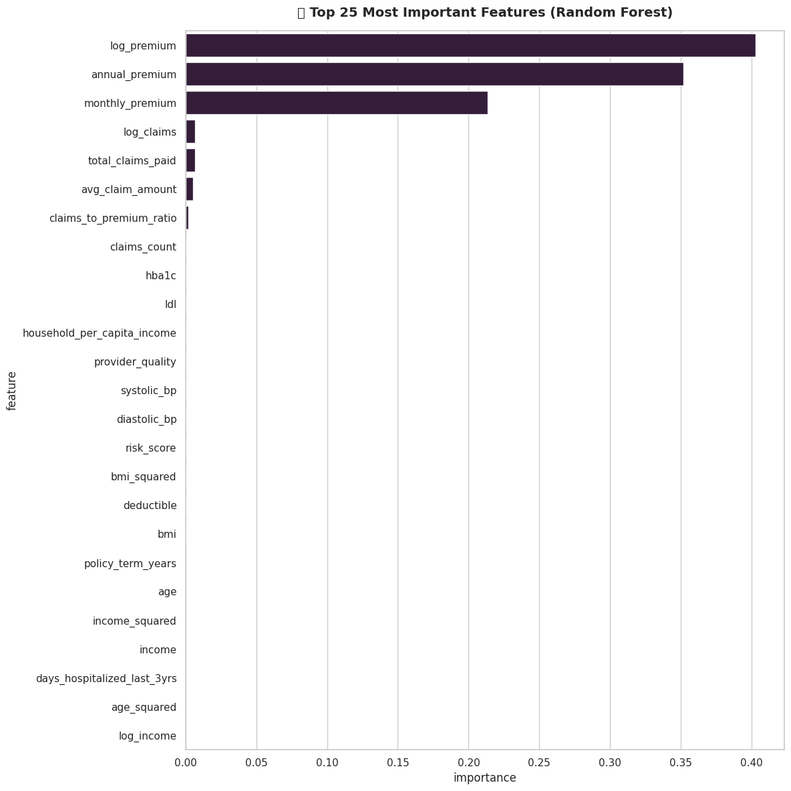
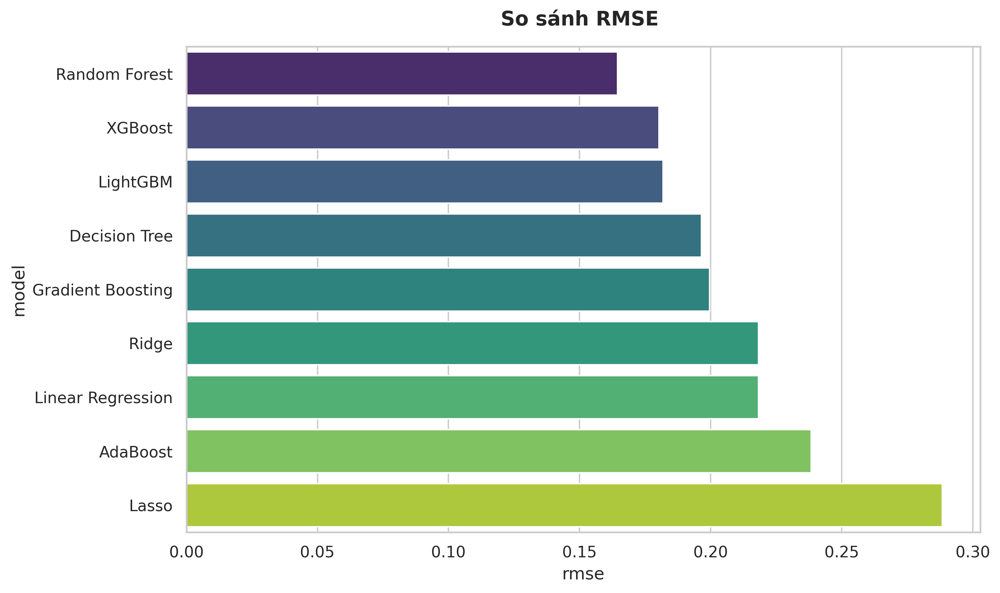
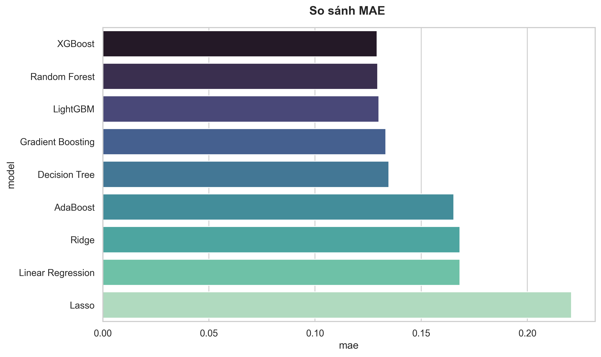
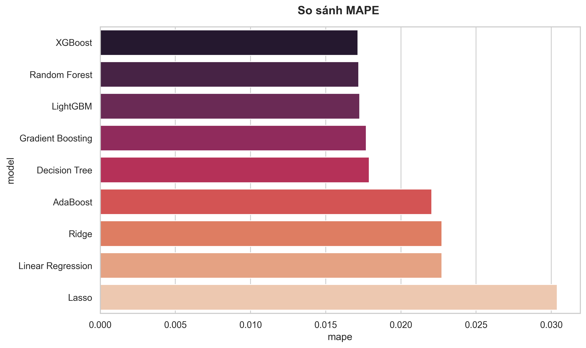
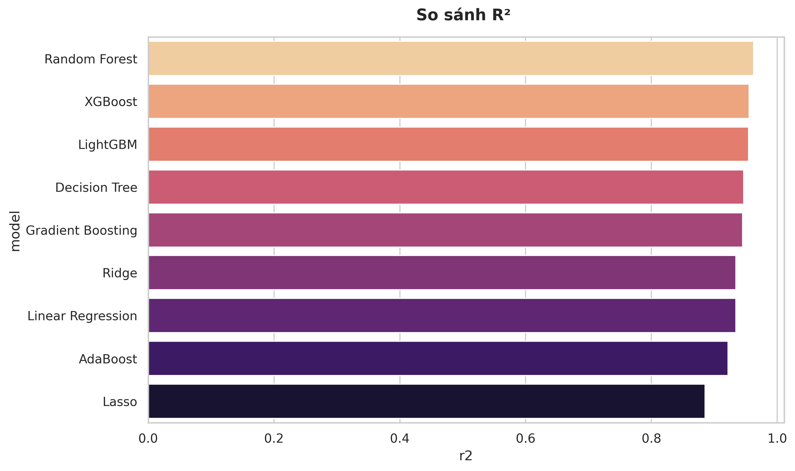
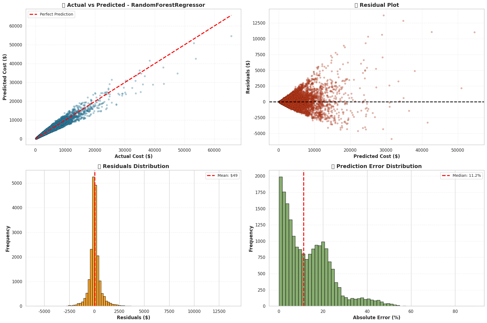

Đồ án cuối kỳ môn Python cho khoa học dữ liệu


````markdown
# 🏥 Dự đoán Chi Phí Y Tế (Medical Cost Prediction)

Dự án Machine Learning End-to-End nhằm dự đoán chi phí y tế hằng năm (`annual_medical_cost`) dựa trên hồ sơ nhân khẩu học, sức khỏe và bảo hiểm của bệnh nhân. Dự án được xây dựng theo hướng đối tượng (OOP) với các module tái sử dụng cao.

## 🎯 Bối cảnh & Mục tiêu
Chi phí chăm sóc sức khỏe đang là gánh nặng lớn đối với nhiều cá nhân và tổ chức bảo hiểm. Dự án này được xây dựng nhằm giải quyết bài toán: **"Liệu có thể dự đoán chính xác chi phí y tế hằng năm dựa trên hồ sơ cá nhân?"**

Dữ liệu bao gồm 100.000 bản ghi với các nhóm thông tin:
* **Demographics:** Tuổi, giới tính, vùng miền.
* **Lifestyle:** Chỉ số BMI, hút thuốc, tập thể dục.
* **Medical History:** Tiền sử bệnh lý (tiểu đường, cao huyết áp...).
* **Insurance:** Loại gói bảo hiểm, hạn mức.

**Mục tiêu chính:** Xây dựng mô hình hồi quy (Regression) để dự đoán `annual_medical_cost`, giúp các công ty bảo hiểm đánh giá rủi ro và cá nhân hóa gói dịch vụ.


## 🌟 Tính năng nổi bật

* **Pipeline Tiền xử lý dữ liệu mạnh mẽ (`preprocess.py`):**
    * Tự động xử lý giá trị thiếu (Mean, Median, Forward-fill).
    * Phát hiện và xử lý ngoại lai (Outliers) bằng IQR hoặc Isolation Forest.
    * Feature Engineering: Tách ngày tháng, One-Hot Encoding, Ordinal Encoding.
    * Chuẩn hóa dữ liệu (Scaling) để chống rò rỉ dữ liệu (Data Leakage).
* **Huấn luyện mô hình tự động (`model_trainer.py`):**
    * Hỗ trợ chạy đua (Race) giữa nhiều mô hình: Random Forest, XGBoost, Linear Regression, SVM...
    * Tự động tối ưu tham số (Hyperparameter Tuning) bằng Random Search.
    * Lưu trữ artifact trọn gói (Model + Scaler + Metrics).
* **Trực quan hóa dữ liệu (`visualize.py`):**
    * Hệ thống vẽ biểu đồ chuẩn hóa, dễ dàng so sánh hiệu suất mô hình.
    * Hỗ trợ vẽ Dashboard so sánh đa chỉ số (RMSE, MAE, R2).

## 📂 Cấu trúc dự án

```text
├── data/                       # Chứa file dữ liệu gốc (csv, xlsx)
├── results/                    # Kết quả đầu ra (Logs, Models, Charts)
│   ├── best_model.pkl          # Model tốt nhất đã huấn luyện
│   ├── training.log            # Log quá trình chạy
│   └── model_comparison.csv    # Bảng so sánh các model
│   ├── các plot so sánh các model
├── preprocess.py               # Module làm sạch và biến đổi dữ liệu
├── visualize.py                # Module trực quan hóa
├── model_trainer.py            # Module quản lý huấn luyện và đánh giá
├── EDA.ipynb                   # Notebook để chạy phần EDA của dự án
├── FE_MODELING.ipynb           # Notebook để chạy feature engineering và modeling
├── requirements.txt            # Các thư viện cần thiết
└── README.md                   # Hướng dẫn sử dụng
````

## 🛠️ Cài đặt

### 1\. Yêu cầu hệ thống

  * Python 3.8 trở lên.
  * Các thư viện: pandas, numpy, scikit-learn, matplotlib, seaborn, joblib, xgboost, lightgbm.

### 2\. Cài đặt thư viện

Chạy lệnh sau để cài đặt các gói cần thiết:

```bash
pip install -r requirements.txt
```


-----

## 🚀 Hướng dẫn sử dụng

### Bước 1: Chuẩn bị dữ liệu và Tiền xử lý

Sử dụng `DataManager` và các bộ xử lý trong `preprocess.py`.

```python
from preprocess import DataManager, Imputer, Scaler, FeatureEngineer, OutlierHandler

# 1. Load dữ liệu
manager = DataManager('data/medical_cost.csv')

# 2. Định nghĩa Pipeline
steps = [
    Imputer(strategy='mean', columns=['bmi', 'income']),
    FeatureEngineer(one_hot_cols=['region', 'smoker'], ordinal_cols={'education': ['No HS', 'HS', 'Bachelor']}),
    OutlierHandler(method='isolation_forest', action='remove'),
    Scaler(method='standard')
]

# 3. Áp dụng
for step in steps:
    manager.apply(step)

df_clean = manager.get_data()
```

### Bước 2: Huấn luyện và So sánh mô hình

Sử dụng `ModelTrainer` để tự động tìm mô hình tốt nhất.

```python
from model_trainer import ModelTrainer
from sklearn.ensemble import RandomForestRegressor, GradientBoostingRegressor

# 1. Khởi tạo
trainer = ModelTrainer(task_type='regression')
trainer.load_data(df_clean.drop('annual_medical_cost', axis=1), df_clean['annual_medical_cost'])
trainer.split_data()

# 2. Cấu hình các model cần đua
models_config = {
    'RandomForest': (RandomForestRegressor(), {'n_estimators': [50, 100]}),
    'GradientBoosting': (GradientBoostingRegressor(), {'learning_rate': [0.01, 0.1]})
}

# 3. Chạy tự động
trainer.auto_train(models_config, output_dir='results')
```

### Bước 3: Đánh giá và Trực quan hóa

Sử dụng `DataVisualizer` để xem kết quả.

```python
import pandas as pd
from visualize import DataVisualizer

# 1. Đọc kết quả so sánh
df_results = pd.read_csv('results/model_comparison.csv')

# 2. Vẽ biểu đồ so sánh RMSE
viz = DataVisualizer(df_results)
viz.plot_bar(x='score', y='model', title='So sánh RMSE (Thấp hơn là tốt)')
```

-----

## 💡 Insight quan trọng từ dữ liệu (EDA)

Sau quá trình phân tích khám phá, chúng tôi rút ra các kết luận chính ảnh hưởng đến mô hình:

* **Mức độ sử dụng dịch vụ y tế (Healthcare Utilization):** Số lần khám bác sĩ, số lần nhập viện và số lượng thuốc sử dụng là những yếu tố dự báo hàng đầu (Top 1).
* **Bệnh mãn tính (Chronic Conditions):** Số lượng và loại bệnh mãn tính tác động cực lớn đến chi phí.
* **Tương tác Tuổi × Sức khỏe:** Người cao tuổi mắc nhiều bệnh nền sẽ có chi phí tăng theo **cấp số nhân** chứ không phải phép cộng đơn thuần.
* **Điểm rủi ro (Risk Scores):** Các chỉ số đánh giá rủi ro được tính toán trước có giá trị dự báo rất cao.
* **Chỉ số lâm sàng:** Huyết áp, cholesterol và chỉ số HbA1c đóng vai trò quan trọng.
* **Yếu tố bảo hiểm:** Mức khấu trừ (deductibles), đồng chi trả (copays) và lịch sử yêu cầu bồi thường (claims history) đóng góp đáng kể vào việc dự đoán.

**

## 📊 Kết quả thực nghiệm & So sánh (Model Evaluation)

Hệ thống đã tự động huấn luyện và so sánh nhiều thuật toán khác nhau (Linear, Tree-based, Boosting). Dưới đây là kết quả đánh giá trên tập kiểm thử (Test Set):

### 1. Bảng xếp hạng hiệu suất
*Đơn vị đo lường chính: RMSE (Root Mean Squared Error) - Càng thấp càng tốt.*

| Xếp hạng | Mô hình (Model) | RMSE (Log Scale) | Nhận xét hiệu năng |
| :---: | :--- | :---: | :--- |
| 🏆 **1** | **Random Forest** | **0.1644** | **Quán quân.** Hiệu suất vượt trội nhờ khả năng xử lý phi tuyến tính và tương tác phức tạp giữa các biến. |
| 🥈 2 | XGBoost | 0.1803 | Á quân. Tốc độ huấn luyện rất nhanh và hiệu suất gần sát với Random Forest. |
| 🥉 3 | LightGBM | 0.1819 | Tối ưu tài nguyên bộ nhớ, rất phù hợp khi dataset mở rộng lớn hơn. |
| 4 | Decision Tree | 0.1964 | Khá tốt nhưng dễ bị overfitting so với các phương pháp Ensemble (Rừng cây). |
| 5 | Gradient Boosting | 0.1995 | Ổn định, nhưng trong trường hợp này chưa tối ưu bằng XGBoost/LightGBM. |
| 6 | Linear Regression | 0.2182 | Hiệu suất thấp hơn nhóm cây. Chỉ bắt được các mối quan hệ tuyến tính cơ bản. |
| 7 | Ridge Regression | 0.2182 | Tương tự Linear Regression, việc điều chuẩn (Regularization) không giúp cải thiện nhiều trong trường hợp này. |
| 8 | AdaBoost | 0.2384 | Hiệu suất kém ấn tượng nhất trong nhóm Boosting ở bài toán này. |
| 9 | Lasso Regression | 0.2884 | Kém nhất. Việc ép các hệ số về 0 (Feature Selection quá mạnh) có thể đã làm mất thông tin quan trọng. |

*(Lưu ý: RMSE được tính trên biến mục tiêu `annual_medical_cost` đã qua xử lý Log-transform)*

### 2. Biểu đồ so sánh trực quan
Biểu đồ dưới đây minh họa sự chênh lệch về sai số giữa các mô hình, cho thấy sự vượt trội của nhóm thuật toán **Ensemble Learning** (Random Forest, Boosting) so với các thuật toán truyền thống.

**
**
**
**


### 3. Phân tích kết quả
* **Chiến thắng của Tree-based Models:** Random Forest và XGBoost vượt trội vì dữ liệu y tế chứa nhiều ngưỡng (thresholds) và tương tác phi tuyến. Ví dụ: BMI chỉ thực sự làm tăng vọt chi phí khi vượt qua mức 30 (béo phì) và đi kèm với việc hút thuốc. Linear Regression khó học được điều này nếu không tạo biến tương tác thủ công.
* **Độ ổn định:** Random Forest cho thấy độ biến thiên thấp (Low Variance) khi kiểm thử chéo (Cross-validation), chứng tỏ mô hình ít bị Overfitting.


| Metric | Giá trị (Log Scale) | Ý nghĩa |
| :--- | :--- | :--- |
| **RMSE** | \~0.1644 | Sai số trung bình phương căn (Root Mean Squared Error) |
| **MAE** | \~0.1303 | Sai số tuyệt đối trung bình |
| **R²** | \~0.9627 | Mức độ giải thích độ biến thiên dữ liệu |
| **MAPE**| \~0.0173 | Sai số phần trăm trung bình|

-----
**

## 📝 Ghi chú cho Google Colab

Nếu chạy trên Google Colab, hãy upload 3 file module (`preprocess.py`, `visualize.py`, `model_trainer.py`) vào cùng thư mục với Notebook, hoặc mount Google Drive:

```python
from google.colab import drive
drive.mount('/content/drive')
import sys
sys.path.append('/content/drive/MyDrive/path_to_your_project')
```

## 🚀 Hướng phát triển tiếp theo (Roadmap)

Dù mô hình hiện tại đã đạt kết quả tốt (RMSE ~0.16), dự án vẫn có thể cải thiện thêm:

* **Deploy Model:** Xây dựng API bằng **FastAPI** hoặc **Flask** để phục vụ dự đoán realtime.
* **Dockerize:** Đóng gói toàn bộ môi trường chạy vào Docker Container để dễ dàng triển khai.
* **Feature Selection nâng cao:** Sử dụng SHAP values để giải thích mô hình rõ ràng hơn (Explainable AI).
* **Deep Learning:** Thử nghiệm mạng nơ-ron (Neural Network) với Keras/TensorFlow để xem có vượt qua được Random Forest không.


## 👥 Tác giả

  * **Họ và tên:** Nguyễn Hữu Phước, Nguyễn Chí Tiến
 

-----

````


